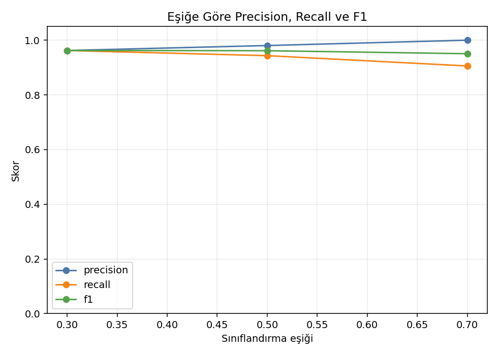

# Meme Tümörü Sınıflandırması

## Amaç

Wisconsin Diagnostic Breast Cancer veri setindeki hücre çekirdeği ölçümlerini
kullanarak bir tümörün kötü huylu olma olasılığını Logistic Regression ile
tahmin etmektir.

Veri setinde 569 örnek ve 30 sayısal özellik bulunur. Bu projede pozitif sınıf
`1 = kötü huylu`, negatif sınıf `0 = iyi huylu` olarak tanımlanmıştır.

## Modelleme yaklaşımı

- Veriler sınıf oranı korunarak eğitim ve test olarak ayrılır.
- Özellikler yalnız eğitim verisinden öğrenilen değerlerle standartlaştırılır.
- Sınıf dengesini dikkate alan Logistic Regression modeli eğitilir.
- Accuracy yanında precision, recall, F1 ve ROC-AUC raporlanır.
- 0.30, 0.50 ve 0.70 eşikleri karşılaştırılır.

Sağlıkla ilişkili sınıflandırmalarda yanlış negatiflerin önemi nedeniyle eşik
analizi özellikle gösterilmiştir. Eşik düşürüldüğünde recall genellikle artar;
ancak daha fazla yanlış pozitif oluşabilir.

## Çalıştırma

```bash
python MachineLearning/Supervised/02_logistic_regresyon/breast_cancer_diagnosis/breast_cancer_logistic.py
```

Grafikler `figures/`, metrik ve katsayı dosyaları `results/` klasörüne
kaydedilir.

## Sonuçlar

| Metrik | Değer |
|---|---:|
| Accuracy | 0.9720 |
| Precision | 0.9804 |
| Recall | 0.9434 |
| F1 | 0.9615 |
| ROC-AUC | 0.9950 |

5-fold cross-validation sonucu `ROC-AUC = 0.9951 ± 0.0055` olarak ölçülmüştür.
Varsayılan `0.50` eşiğinde 0.9434 olan recall, eşik `0.30` yapıldığında 0.9623'e
çıkmıştır. Bu değişim, karar eşiğinin problem maliyetine göre seçilmesi
gerektiğini gösterir.




Veri kaynağı: scikit-learn yerleşik `load_breast_cancer` veri seti.

> Bu çalışma yalnızca makine öğrenmesi eğitimi içindir; tıbbi teşhis veya tedavi
> amacıyla kullanılamaz.
