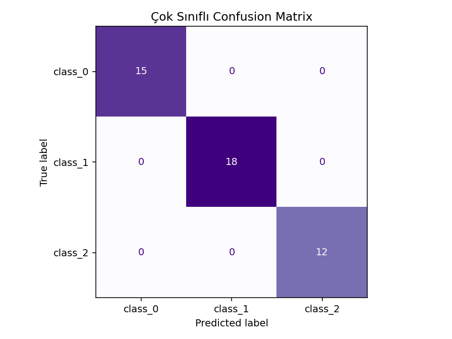
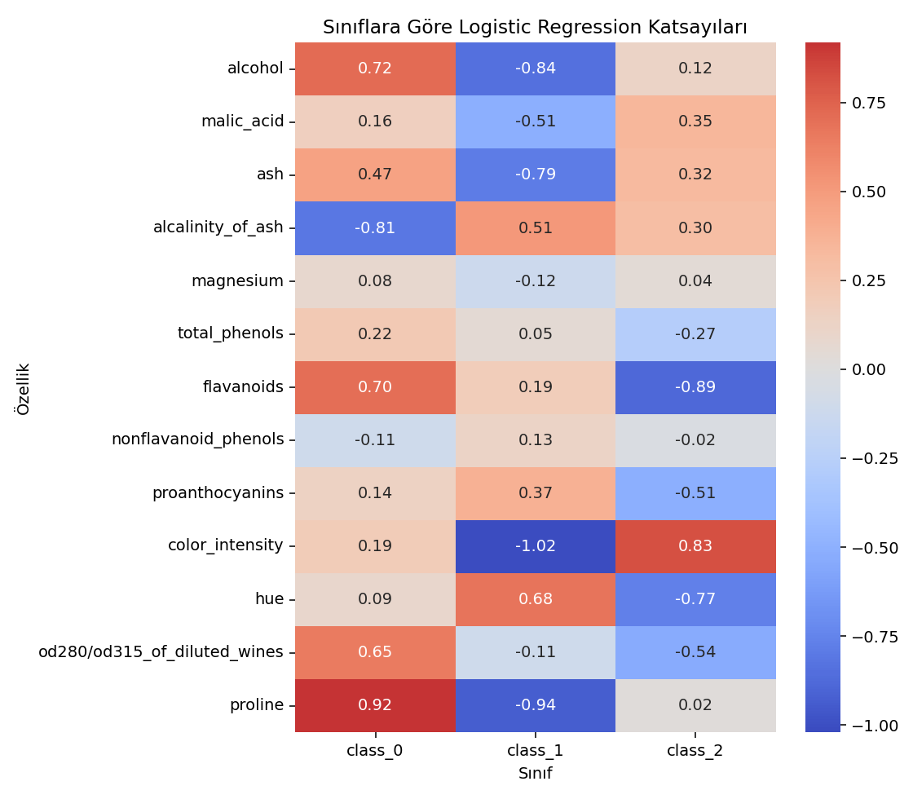

# Şarap Türü Sınıflandırması

## Amaç

İtalya'nın aynı bölgesinde yetiştirilen üç farklı şarap sınıfını 13 kimyasal
ölçümden tahmin etmek ve Logistic Regression'ın çok sınıflı problemlerde nasıl
çalıştığını göstermektir.

Wine Recognition veri setinde 178 örnek bulunur. Model, her sınıf için olasılık
üretir ve en yüksek olasılığa sahip sınıfı tahmin olarak seçer.

## Uygulanan analizler

- Sınıf oranını koruyan eğitim/test ayrımı
- StandardScaler ve Logistic Regression Pipeline'ı
- Macro precision, recall ve F1
- Çok sınıflı ROC-AUC (One-vs-Rest)
- Sınıf bazında classification report
- Katsayı ısı haritası
- PCA ile iki boyutlu veri görünümü
- 5-fold stratified cross-validation

## Çalıştırma

```bash
python MachineLearning/Supervised/02_logistic_regresyon/wine_classification/wine_logistic.py
```

Grafikler `figures/`; metrikler, katsayılar ve sınıf bazlı raporlar `results/`
klasörüne kaydedilir.

## Sonuçlar

| Metrik | Değer |
|---|---:|
| Accuracy | 1.0000 |
| Macro Precision | 1.0000 |
| Macro Recall | 1.0000 |
| Macro F1 | 1.0000 |
| One-vs-Rest ROC-AUC | 1.0000 |
| Log Loss | 0.0671 |

Test kümesindeki 45 örneğin tamamı doğru sınıflandırılmıştır. Daha güvenilir bir
genelleme kontrolü için yapılan 5-fold cross-validation sonucunda ortalama
Macro-F1 `0.9829 ± 0.0140` bulunmuştur.





Veri kaynağı: scikit-learn yerleşik `load_wine` veri seti.
