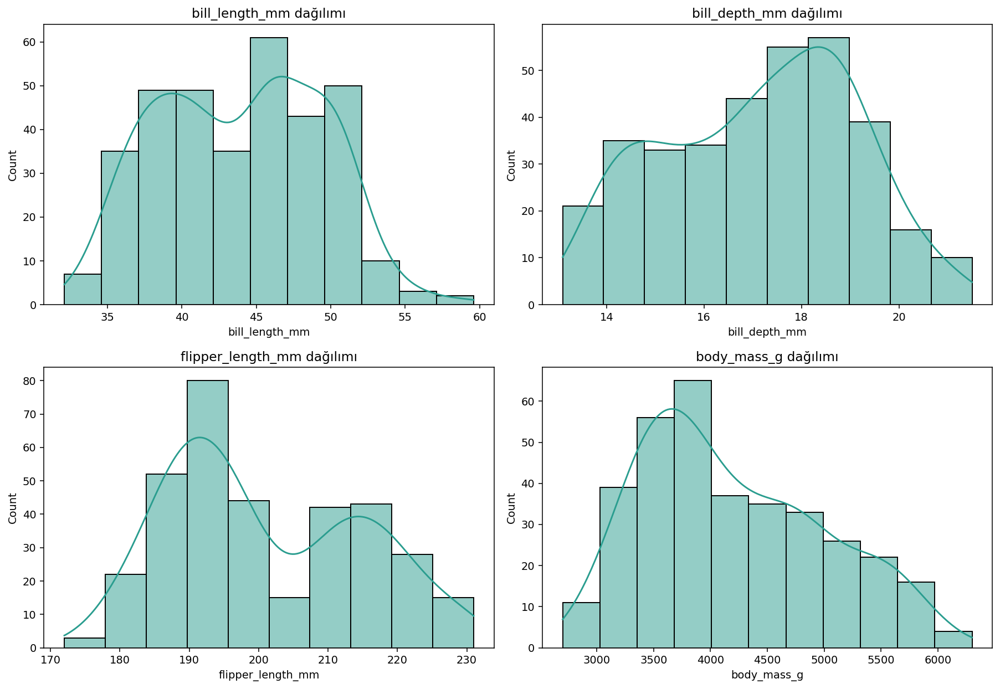
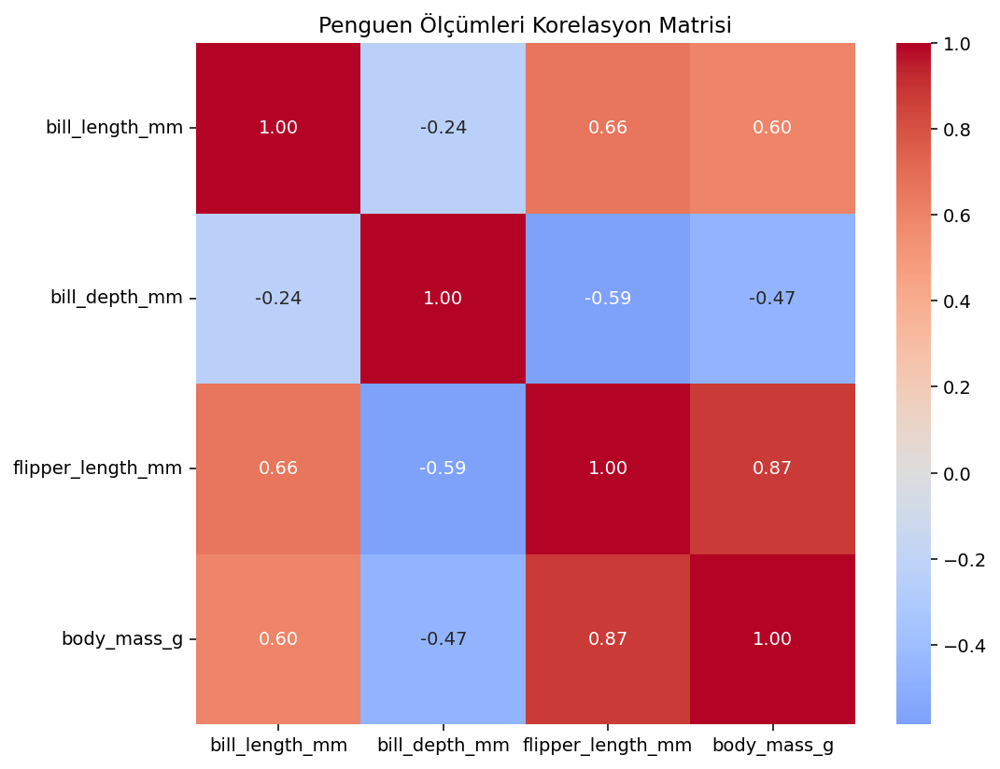
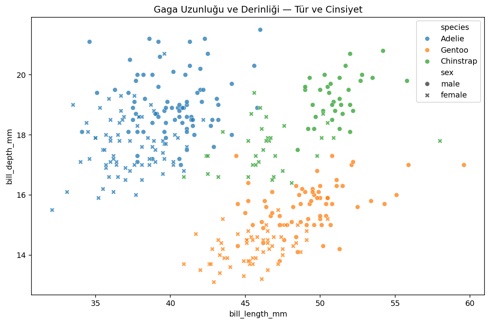
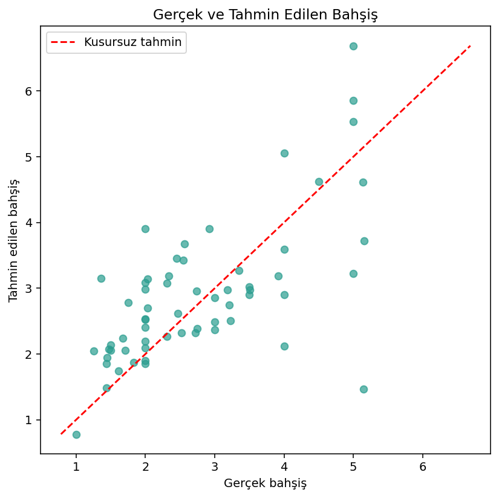
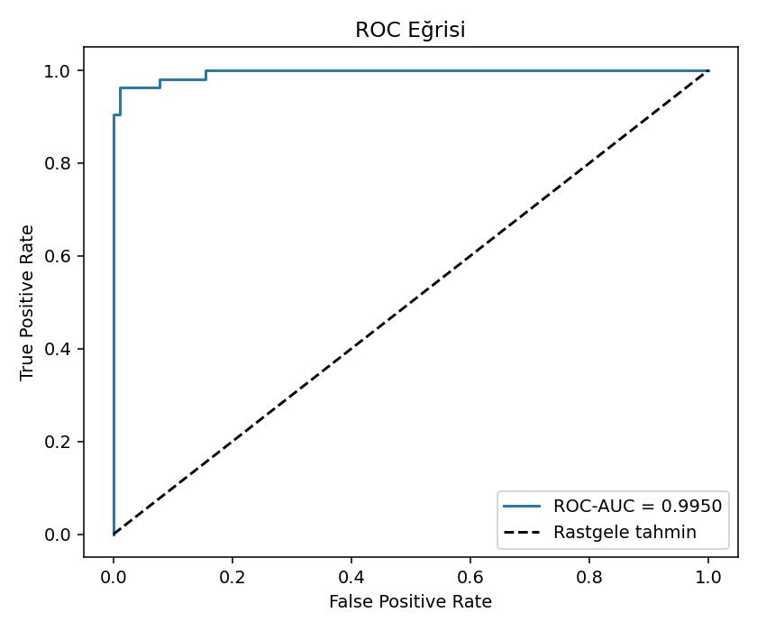
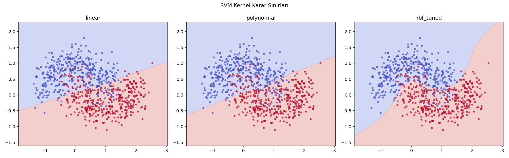

# Softito Python ve Yapay Zeka Çalışmaları


Softito Yapay Zeka Yazılımcılığı eğitimi boyunca işlenen konuların gerçek veya
özgün veri setleri üzerinde uygulandığı, çalıştırılabilir Python projelerinden
oluşan eğitim reposudur.

Bu repo yalnızca konu anlatımı içermez. Her bölümde veri yükleme, analiz,
raporlama, çıktı üretme ve otomatik test adımları birlikte uygulanır. Kodların
tamamı Türkçe açıklamalara sahiptir ve macOS, Linux veya Windows üzerinde
yeniden çalıştırılabilecek şekilde hazırlanmıştır.

## İçerik

| No | Bölüm | Uygulama | Veri seti | Durum |
|---|---|---|---|---|
| 01 | Python Temelleri | Fonksiyon, döngü, sözlük, class, CSV ve JSON işlemleri | Scikit-learn Iris | Tamamlandı |
| 02 | Detaylı Python | Başlangıçtan ileri OOP'ye beş bağımsız uygulama | E-ticaret satış verisi | Tamamlandı |
| 03 | EDA | Yükleme, temizleme, tek/çift değişkenli analiz ve feature engineering | Palmer Penguins | Tamamlandı |
| 04 | Linear Regression | Basit/çoklu regresyon, katsayılar ve artık analizi | Tips + Diabetes | Tamamlandı |
| 05 | Logistic Regression | İkili/çok sınıflı tahmin, ROC ve eşik analizi | Breast Cancer + Wine | Tamamlandı |
| 06 | Klasik ML Algoritmaları | Polynomial, Tree, KNN/NB, SVM ve Boosting | 5 farklı uygulama | Tamamlandı |

## Öne çıkan çalışmalar

### 01 — Iris ile Python temelleri

150 çiçek kaydı kullanılarak Python'ın temel yapıları gerçek veri üzerinde
uygulandı. Tür bazında ölçüm ortalamaları hesaplandı; sonuçlar CSV ve JSON
dosyalarına kaydedildi.

Uygulanan konular:

- Değişkenler, veri tipleri ve operatörler
- Liste, sözlük, koşul ve döngüler
- Fonksiyon ve class oluşturma
- Hata yönetimi
- CSV ve JSON dosya işlemleri
- `argparse` ve `pathlib`

### 02 — Detaylı Python uygulamaları

15 satırlık özgün e-ticaret satış verisi üzerinde beş aşamalı çalışma yapıldı.
Toplam ciro, kategori performansı, müşteri puanları ve sipariş yapıları analiz
edildi.

Uygulanan konular:

- String, liste, tuple, set ve dictionary işlemleri
- `enumerate`, `zip`, lambda ve comprehension
- `*args`, `**kwargs`, recursive fonksiyon ve dosya işlemleri
- Kalıtım, kapsülleme, property, classmethod ve staticmethod
- Iterator, mixin ve dunder metotlar

### 03 — Palmer Penguins EDA

344 penguene ait 8 sütun incelendi. 19 eksik değer temizlendi ve feature
engineering sonunda veri seti 16 sütuna çıkarıldı.

Başlıca sonuçlar:

- Adelie: 152, Gentoo: 124, Chinstrap: 68 kayıt
- Yüzgeç uzunluğu ile vücut kütlesi arasında `0.87` korelasyon
- Sayısal eksikler tür medyanı, kategorik eksikler mod ile dolduruldu
- Vücut kütlesi, gaga alanı ve yüzgeç/kütle oranından yeni özellikler üretildi
- Ada bilgisi one-hot encoding ile sayısallaştırıldı







### 04 — Linear Regression

İki farklı gerçek veri seti üzerinde basit ve çoklu doğrusal regresyon
uygulandı. Restoran projesinde hesap tutarından bahşiş tahmini, sağlık
projesinde ise on klinik ölçümden bir yıllık hastalık ilerleme skoru tahmini
yapıldı.

- R², MAE ve RMSE ile model değerlendirme
- Basit ve çoklu regresyon karşılaştırması
- One-hot encoding ile kategorik değişken dönüşümü
- Katsayıların yön ve büyüklük açısından yorumlanması
- Gerçek–tahmin ve artık grafikleri
- 5-fold cross-validation

Restoran verisinde basit modelin, diyabet verisinde ise çoklu modelin daha iyi
sonuç vermesi; fazla özellik eklemenin tek başına başarı garantisi olmadığını
gösterdi.



### 05 — Logistic Regression

İkili ve çok sınıflı iki gerçek veri seti üzerinde sınıflandırma modelleri
kuruldu. Meme tümörü çalışmasında kötü huylu sınıfın yakalanması ve karar
eşiğinin precision/recall dengesine etkisi; şarap çalışmasında ise üç sınıfın
One-vs-Rest yaklaşımıyla ayrılması incelendi.

- StandardScaler ve Pipeline ile veri sızıntısını önleyen modelleme
- Accuracy, precision, recall, F1 ve ROC-AUC
- Confusion matrix ve ROC eğrileri
- Sınıflandırma eşiği karşılaştırması
- Çok sınıflı katsayı ısı haritası
- Stratified 5-fold cross-validation



### 06 — Klasik makine öğrenmesi paketi

Ders arşivindeki Polynomial Regression, Decision Tree, KNN, Naive Bayes, SVM,
AdaBoost ve XGBoost başlıkları beş özgün uygulamada bir araya getirildi.

- Enerji talebinde polinom derecesi ve bias–variance karşılaştırması
- Çalışan terfi tahmininde Decision Tree ve GridSearchCV
- Digits veri setinde KNN ve Gaussian Naive Bayes
- İç içe geçmiş sınıflarda linear, polynomial ve RBF-SVM
- Makine arıza riskinde AdaBoost, Gradient Boosting ve opsiyonel XGBoost

Başlıca sonuçlar: 3. derece polinom `R² = 0.9770`, Decision Tree
`ROC-AUC = 0.8038`, KNN accuracy `0.9711`, RBF-SVM accuracy `0.9200` ve
Gradient Boosting `ROC-AUC = 0.8730`.



## Repo yapısı

```text
softito_python_ai/
├── Python/
│   ├── 01_python_temelleri/
│   └── 02_python_detayli/
├── EDA/
│   ├── 01_veri_yukleme_genel_bakis/
│   ├── 02_veri_temizleme/
│   ├── 03_tek_degiskenli_analiz/
│   ├── 04_cift_degiskenli_analiz/
│   ├── 05_feature_engineering/
│   └── data/
├── MachineLearning/
│   └── Supervised/
│       ├── 01_linear_regresyon/
│       ├── 02_logistic_regresyon/
│       └── 03_classic_ml/
├── requirements.txt
└── README.md
```

Her çalışma klasöründe şu dosyalar bulunur:

- Açıklayıcı `README.md`
- Çalıştırılabilir `.py` dosyası
- Kullanılan veya otomatik oluşturulan veri
- Grafiklerin bulunduğu `figures/` klasörü
- CSV, JSON veya TXT sonuçlarının bulunduğu `outputs/` klasörü
- Davranışları doğrulayan otomatik testler

## Kurulum

Repoyu bilgisayarınıza indirin:

```bash
git clone https://github.com/mucahitesaday/softito_python_ai.git
cd softito_python_ai
```

Sanal ortam oluşturup etkinleştirin.

macOS/Linux:

```bash
python3 -m venv .venv
source .venv/bin/activate
```

Windows PowerShell:

```powershell
python -m venv .venv
.venv\Scripts\Activate.ps1
```

Bağımlılıkları kurun:

```bash
python -m pip install --upgrade pip
python -m pip install -r requirements.txt
```

## Çalıştırma

### Python temelleri

```bash
python Python/01_python_temelleri/python_temelleri_iris.py
```

### Detaylı Python

```bash
python Python/02_python_detayli/01_python_baslangic.py
python Python/02_python_detayli/02_koleksiyonlar_ve_fonksiyonlar.py
python Python/02_python_detayli/03_python_alistirmalari.py
python Python/02_python_detayli/04_ileri_veri_yapilari.py
python Python/02_python_detayli/05_nesne_yonelimli_programlama.py
```

### EDA

```bash
python EDA/01_veri_yukleme_genel_bakis/veri_yukleme.py
python EDA/02_veri_temizleme/veri_temizleme.py
python EDA/03_tek_degiskenli_analiz/tek_degiskenli_analiz.py
python EDA/04_cift_degiskenli_analiz/cift_degiskenli_analiz.py
python EDA/05_feature_engineering/feature_engineering.py
```

### Machine Learning

```bash
python MachineLearning/Supervised/01_linear_regresyon/restaurant_tip_prediction/tip_regression.py
python MachineLearning/Supervised/01_linear_regresyon/diabetes_progression/diabetes_regression.py
python MachineLearning/Supervised/02_logistic_regresyon/breast_cancer_diagnosis/breast_cancer_logistic.py
python MachineLearning/Supervised/02_logistic_regresyon/wine_classification/wine_logistic.py
python MachineLearning/Supervised/03_classic_ml/01_polynomial_regression/energy_polynomial.py
python MachineLearning/Supervised/03_classic_ml/02_decision_tree/promotion_tree.py
python MachineLearning/Supervised/03_classic_ml/03_knn_naive_bayes/digits_comparison.py
python MachineLearning/Supervised/03_classic_ml/04_svm/moons_svm.py
python MachineLearning/Supervised/03_classic_ml/05_boosting/maintenance_boosting.py
```

## Testler

Projelerde toplam 28 otomatik test bulunur:

```bash
python -m unittest discover -s Python/01_python_temelleri -p "test_*.py" -v
python -m unittest Python/02_python_detayli/test_python_detayli.py -v
python -m unittest EDA/test_eda.py -v
python -m unittest MachineLearning/Supervised/01_linear_regresyon/test_linear_regresyon.py -v
python -m unittest MachineLearning/Supervised/02_logistic_regresyon/test_logistic_regresyon.py -v
python -m unittest MachineLearning/Supervised/03_classic_ml/test_classic_ml.py -v
```

## Kullanılan veri setleri

| Veri seti | Kullanım | Kaynak |
|---|---|---|
| Iris | Python temelleri | Scikit-learn yerleşik veri seti |
| E-ticaret satışları | Detaylı Python alıştırmaları | Eğitim amacıyla özgün oluşturuldu |
| Palmer Penguins | EDA ve feature engineering | [Resmî proje](https://allisonhorst.github.io/palmerpenguins/) |
| Tips | Bahşiş için Linear Regression | Seaborn veri deposu |
| Diabetes | İlerleme skoru için Linear Regression | Scikit-learn yerleşik veri seti |
| Breast Cancer Wisconsin | İkili Logistic Regression | Scikit-learn yerleşik veri seti |
| Wine Recognition | Çok sınıflı Logistic Regression | Scikit-learn yerleşik veri seti |
| Enerji talebi | Polynomial Regression | Eğitim amacıyla özgün oluşturuldu |
| Çalışan terfi verisi | Decision Tree | Eğitim amacıyla özgün oluşturuldu |
| Digits | KNN ve Naive Bayes | Scikit-learn yerleşik veri seti |
| Moons | SVM kernel karşılaştırması | Scikit-learn veri üreticisi |
| Makine sensörleri | Boosting karşılaştırması | Eğitim amacıyla özgün oluşturuldu |

Palmer Penguins verisi CC0 lisansıyla yayımlanmıştır. Veri dosyası repoda
bulunduğundan çalıştırmak için Kaggle hesabı veya API anahtarı gerekmez.

## Kullanılan teknolojiler

- Python
- Pandas ve NumPy
- Matplotlib ve Seaborn
- Scikit-learn
- CSV ve JSON
- `unittest`
- Git ve GitHub

## Yol haritası

- [x] Python temelleri
- [x] İleri Python ve nesne yönelimli programlama
- [x] Keşifsel veri analizi
- [x] Denetimli makine öğrenmesi (regresyon, sınıflandırma, ağaçlar, SVM, boosting)
- [ ] Denetimsiz makine öğrenmesi
- [ ] Doğal dil işleme
- [ ] Derin öğrenme ve görüntü işleme
- [ ] LLM, RAG ve model uyarlama
- [ ] Docker ve büyük veri uygulamaları

## Geliştirme yaklaşımı

Her bölüm ayrı bir branch üzerinde hazırlanır. Kodlar önce yerel ortamda ve
ardından farklı bir macOS ortamında çalıştırılır. Testler geçtikten sonra pull
request üzerinden `main` branch'ine birleştirilir. Böylece `main` üzerinde
yalnızca çalıştığı doğrulanmış dosyalar tutulur.

## Hazırlayan

**Mücahit Esad Ay**

[GitHub profili](https://github.com/mucahitesaday)
